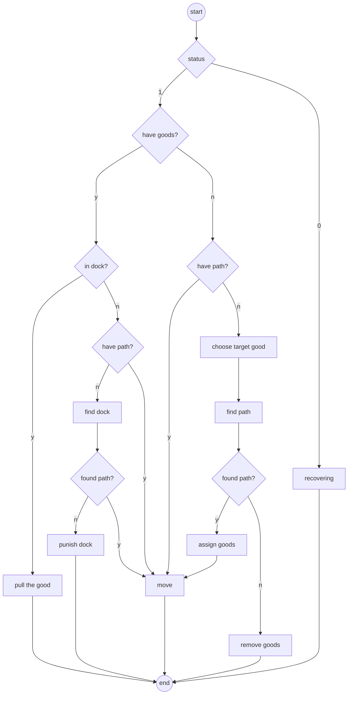
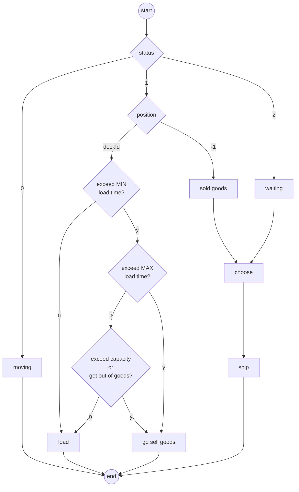

[TOC]

# Run

```shell
# Run with default configuration
java -jar XXX.jar

# Run with configuration
# There must 6 args.
java -jar XXX.jar \
# int
H_SHIP_CAPACITY_THRESHOLD   \ 
# double 0~1
H_MAX_SHIP_LOAD_TIME        \ 
# int
H_SHIP_REDIRECT_THRESHOLD   \ 
# int 
H_ASTAR_MAX_TIME_GOODS      \
# int
H_ASTAR_MAX_TIME_DOCK       \
# int
H_DOCK_PUNISH               \
# bool
H_BOT_FIND_GOOD_ITERATOR    \
# bool
H_BOT_FIND_DOCK_ITERATOR
```

## Grid Searching hyper-parameters

This is a shell script to run the judge program with different hyper-parameters.

The result will be saved in `result.log` and the error will be saved in `err.log`.

The result can be easily analysis by python.

**This is out of date now, just an example.

```shell
EXEC=./PreliminaryJudge # The judge program
MAP_PATH=./map.txt # The map file
JAR_PATH=./XXX.jar # The jar file

RESULT_PATH=./result.log
ERROR_PATH=./err.log

for H_MIN_SHIP_LOAD_TIME in {1..3};
do
  for H_MAX_SHIP_LOAD_TIME in {2..4};
  do
    for H_ASTAR_MAX_TIME in {5..30};
    do
      for H_DOCK_PUNISH in {1,10,100,1000};
      do
        for H_BOT_FIND_GOOD_ITERATOR in {true,false};
        do
          for H_BOT_FIND_DOCK_ITERATOR in {true,false};
          do
            echo "$H_MIN_SHIP_LOAD_TIME $H_MAX_SHIP_LOAD_TIME $H_ASTAR_MAX_TIME $H_DOCK_PUNISH $H_BOT_FIND_GOOD_ITERATOR $H_BOT_FIND_DOCK_ITERATOR" >> $RESULT_PATH;
            $EXEC -l NONE -m $MAP_PATH "java -jar $JAR_PATH $H_MIN_SHIP_LOAD_TIME $H_MAX_SHIP_LOAD_TIME $H_ASTAR_MAX_TIME $H_DOCK_PUNISH $H_BOT_FIND_GOOD_ITERATOR $H_BOT_FIND_DOCK_ITERATOR" >> $RESULT_PATH 2>$ERROR_PATH;
          done
        done
      done
    done
  done
done

```

## Args

- `H_SHIP_CAPACITY_THRESHOLD` - When the capacity of a ship is lower than this, the ship won't redirect to another dock.
- `H_MAX_SHIP_LOAD_TIME` - The maximum frame a ship stay in docks is $\text{H\_MAX\_SHIP\_LOAD\_TIME} *
  \text{boat\_capacity}$
- `H_SHIP_REDIRECT_THRESHOLD` - When ship redirect to another dock for some reason, the `ship.redirect` will increase.
  When it is larger than `H_SHIP_REDIRECT_THRESHOLD`, the ship will go to sell the goods.
- `H_ASTAR_MAX_TIME_XXXX` - The maximum the algorithm will run, in ms.
- `H_DOCK_PUNISH` - The punish value for a dock when a robot can’t find a path to it.
- `H_BOT_FIND_GOOD_ITERATOR` - When `true`, there is only one robot trying to find a path to a goods. When `false`, all
  the robot will.
- `H_BOT_FIND_DOCK_ITERATOR` - When `true`, there is only one robot trying to find a path to a dock. When `false`, all
  the robot will.

# Main Loop

## :robot: Robot Logic



## :ship: Ship Logic



# Cost Functions

在进行多种行为的目标选择时，均遵循以下流程：

1. 对所有的可访问的目标进行遍历，计算cost，并放入优先队列中
2. 结束遍历后从优先队列中选择cost最低的一个目标
3. 涉及路径时对目标进行A*

## Robot choosing Dock

### V1

$$
f(robot, dock) = \frac{distance(robot, dock)} {dock.score}
$$

- `dock.score = 100000 * dock.loading_speed / transport_time`作为评价dock本身质量的标准
    - 越高的score表示dock能更快的装货并以更短的距离卖出货物
- distance为一范数/曼哈顿距离，越短越好

### V2

$$
f(robot, dock) = distance(robot, dock) - dock.score
$$

- Simpler, but better in most of cases.

### V3

$$
f(robot, dock) = distance(robot, dock) - dock.score/2
$$

- Better than V2 on `map-3.8`.

## Robot choosing Goods

### V1

$$
f(robot, goods) = \frac{distance(robot, goods)^3}{goods.value}
$$

- `0 < goods.value <= 200`是货物的价值

### V2

$$
f(robot, goods) = distance(robot, goods) - goods.value
$$

- Simpler, but better in most of cases.

### V3

$$
f(robot, goods) = distance(robot, goods) - goods.value/2
$$

- Better than V2 on `map-3.8`.

## Ship choosing Dock

### V1

$$
f(ship, dock) = \frac{10000}{dock.score \times (\abs{dock.goods}+1)}
$$

- `dock.goods`为dock中剩余货物量，由于多种因素只能获得近似值，防止除零错误进行处理

### V2

$$
f(ship, dock) = dock.score \times \abs{dock.goods}
$$

- same effect to V1, but simpler.

